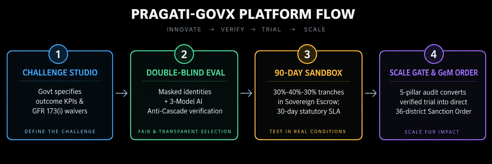

<div align="left">
  
  <h1>Pragati-GovX</h1>
  <p><strong>Sovereign Innovation Sandbox & Agile Public Procurement Gateway</strong></p>
</div>

---

## 📌 Problem Statement (Official from SIH 2026)

* **Competition:** Smart India Hackathon 2026 (SIH 2026)
* **Problem Statement ID:** PS 26136 (PS:136)
* **Problem Statement Title:** *Platform for Government Departments to Procure Innovative Solutions from Startups via Controlled Trials, Regulatory Sandboxes, and Milestone-Based Contracting*
* **Nodal Authority:** Government of Maharashtra — Department of Skills, Employment, Entrepreneurship & Innovation / Maharashtra State Innovation Society (MSInS)
* **Theme:** Smart Governance, Public Procurement & Deep-Tech Startup Enablement
* **Statutory Frameworks:** 
  * Rule 173(i) of General Financial Rules (GFR) 2017
  * Maharashtra State Innovative Startup Policy 2024 (GR No. MAT-2024/CR-88/Ind-7)
  * Section 15 of Micro, Small and Medium Enterprises Development (MSMED) Act 2006
  * Government e-Marketplace (GeM) Special Procurement Gateway

---

## 🚨 Problem Before This Project

Public procurement across state and central government bodies in India has long been paralyzed by legacy administrative and financial constraints. These structural bottlenecks created a formidable "procurement barrier" that systematically excluded startups:

### 1. The GFR Turnover & Prior Experience Catch-22
Standard public tenders mandatorily impose stringent qualification criteria:
* Minimum **₹5 Crore to ₹50 Crore+** prior annual audited turnover over three consecutive fiscal years.
* Minimum **3 to 5 years** of documented past government execution experience.

Early-stage and deep-tech startups—despite having cutting-edge technological solutions (e.g., IoT acoustic pipeline leak detectors, edge AI traffic controllers, drone agricultural imaging)—do not possess years of audited balance sheets. Consequently, they are disqualified at the preliminary technical scrutiny stage before their engineering merit is ever assessed.

### 2. Preference for Balance Sheets Over Engineering Innovation
Tender evaluation frameworks historically favored entrenched, large-scale System Integrators (SIs). These legacy vendors often subcontract work, supply outdated off-the-shelf software, and lack domain-specific innovation. Government departments remained locked into multi-year contracts with obsolete technological infrastructure.

### 3. Bureaucratic Risk Aversion & Fear of Vigilance Inquiries
Departmental nodal officers, municipal commissioners, and mission directors operate under strict oversight from the Comptroller & Auditor General (CAG) and State Vigilance Commissions. Procuring from an unproven startup without a standard tender was perceived as high-risk corruption or negligence. Without a legally recognized "safe-harbor" or finite-risk testing sandbox, officers naturally defaulted to familiar, non-innovative legacy vendors.

### 4. Crippling Financial Burdens (EMD & Bank Guarantees)
Startups were required to lock up substantial working capital in:
* **2% – 5% Earnest Money Deposits (EMD)** upon tender submission.
* **5% – 10% Performance Bank Guarantees (PBG)** held for multi-year warranty periods.

For bootstrapped or seed-funded ventures, locking up lakhs of rupees in bank collateral severely throttles day-to-day R&D and operational runway.

### 5. Lethal Milestone Payment Delays (6 to 18 Months)
Even when a startup was engaged for an ad-hoc trial, bureaucratic payment processing across departmental finance desks routinely took 6 to 18 months. Because early-stage startups operate on lean cash flows, delayed milestone payments frequently pushed innovative ventures into payroll insolvency and shutdown.

### 6. Subjective, Opaque, and Biased Evaluations
Traditional evaluation panels lacked anonymization. Evaluators evaluated submissions with full knowledge of corporate identities, founder credentials, and commercial branding. This enabled unconscious brand bias, political lobbying, and vendor favoritism. Furthermore, evaluation panels had no automated tools to cross-verify technical claims against submitted engineering evidence.

### 7. The "Pilot-to-Procurement Valley of Death"
In the rare cases where a department conducted a successful proof-of-concept (PoC), there was no statutory mechanism to transition that successful pilot into a scalable procurement contract. Departments were legally mandated to float a brand-new open tender, forcing the startup to compete against legacy bidders and often losing the contract to lower-cost, inferior clones.

---

## 💡 Our Solution: Closing the Gap Between Govt of Maharashtra & Startups

**Pragati-GovX** eliminates this structural chasm by establishing a sovereign, outcome-driven innovation gateway. It legally and operationally bridges Maharashtra's 36 administrative districts with verified startups through five core pillars:

<p align="center">
  
</p>

### 1. Statutory Exemption Engine (GFR Rule 173(i) & MH Startup Policy)
* Seamlessly operationalizes **GFR Rule 173(i)** and the **Maharashtra State Innovative Startup Policy 2024**.
* Entering a verified DPIIT recognition number automatically triggers a **100% waiver of prior turnover, prior experience, and EMD requirements**.
* Verified startups can apply with zero balance-sheet prerequisites, competing purely on technical capability and quantifiable outcomes.

### 2. Outcome-Driven Challenge Formulation
* Instead of prescribing rigid, outdated technical specifications, departmental nodal officers utilize the **Challenge Studio** to specify civic challenges via quantifiable benchmarks (e.g., *Baseline: 38.5% water loss → Target: <14% loss across 12km trial zone within 90 days*).
* Challenges are tagged by administrative department, district target zones, and allocated pilot grant corpus.

### 3. Explainable AI Candidate Discovery
* Department officers can instantly discover matching startups from Maharashtra’s innovation ecosystem using a transparent 4-pillar matching algorithm:
  * **Sector Alignment (35%)**
  * **Core Technical Capability (35%)**
  * **Technology Readiness Level / TRL (15%)**
  * **DPIIT Sovereign Recognition (15%)**
* Provides natural language rationale for why each startup fits the challenge, democratizing opportunities for startups from Tier-2 and Tier-3 hubs (Nashik, Nagpur, Aurangabad, Kolhapur, Solapur).

### 4. Double-Blind Meritocratic Evaluation & Conflict-of-Interest (COI) Gate
* All proposals are automatically scrubbed of company names, founder identities, and commercial branding, assigned a synthetic identifier (`ANON-VENTURE-XXXX`).
* Evaluators must sign a legally binding statutory **Conflict-of-Interest (COI) Undertaking** before scores can be unlocked.
* Scoring follows a calibrated 4-pillar rubric (100 pts) evaluating Problem-Solution Fit, Architecture & TRL, Feasibility & Constraints, and Measurable Outcome Impact.

### 5. Multi-Model AI Anti-Cascade Consensus Verification
* Employs an automated, independent 3-model verification cascade:
  * **Layer 1 (Analysis):** Google Gemini 3.6 Flash
  * **Layer 2 (Cross-Audit):** Groq LLaMA-3.3 70B
  * **Layer 3 (Arbiter):** OpenRouter Fallback
* Scrutinizes technical proposals against attached engineering schematics and test logs to detect hallucinations, inflated claims, and architectural gaps, generating an explainable audit report that advises human evaluators without replacing human authority.

### 6. Finite-Risk 90-Day Regulatory Sandboxes (Pilot Canvas)
* Transforms subjective pilots into controlled, legally protected field trials with air-gapped data boundaries.
* Contracts are structured around a transparent milestone schedule:
  * **Phase 1 (Inception & Deployment):** 30% disbursement
  * **Phase 2 (Operational Telemetry & Mid-Term Review):** 40% disbursement
  * **Phase 3 (Final KPI Verification & Audit):** 30% disbursement
* Officers review live sensor telemetry and cryptographic S3 deliverables directly on the **Pilot Canvas** before clearing milestone approvals.

### 7. Sovereign Escrow & Statutory 30-Day Payment SLA Protection
* Resolves startup liquidity starvation by integrating a **Sovereign Treasury Escrow Engine**.
* Milestone grant funds are pre-committed to escrow upon pilot sanction.
* Governed under **Section 15 of the MSMED Act 2006** and Maharashtra government regulations, enforcing a statutory **30-day payment SLA** backed by an automated countdown timer that penalizes unwarranted bureaucratic delays.

### 8. Direct Commercial Onboarding via Scale Gate Console
* Solves the "pilot-to-procurement" bottleneck.
* Completed pilots undergo a 5-pillar Scale Gate audit (KPI achievement, technical robustness, data security, economic viability, organizational readiness).
* Upon approval, the platform auto-generates an official **Government Sanction Order (`GR-MSInS/2026/...`)** aggregating budgets across all 36 Maharashtra districts for direct listing and procurement via the **Government e-Marketplace (GeM)** Special Innovation Window.

### 9. Startup Mitra: Legal & Public Procurement AI Concierge
* Dedicated in-app conversational AI guide designed specifically for verified startup founders on Pragati-GovX.
* **Statutory Framework Literacy:** Demystifies complex public procurement frameworks in plain language — including **GFR Rule 170** (100% EMD exemptions), **GFR Rule 173(i)** (turnover and operating history waivers), **MSMED Act 2006 Sections 15 & 16** (mandatory 45-day payment ceilings, 30-day sandbox SLAs, and 3x RBI bank rate penal interest), **SIPP Scheme** (80% patent rebate), and **GeM Startup Runway**.
* **Dynamic Official Government Reference Links:** Contextually cites official government portals ([Startup India Hub](https://www.startupindia.gov.in), [DPIIT](https://dpiit.gov.in), [Department of Expenditure](https://doe.gov.in), [GeM](https://gem.gov.in), [MSME Samadhaan](https://samadhaan.msme.gov.in), [IP India](https://ipindia.gov.in)).
* **Embedded Platform Action Deep-Links:** Surfaces actionable one-click buttons directing founders straight to the **Startup Passport** (`/startup/profile`), **Civic Challenges** (`/challenges`), **Pilot Canvas** (`/pilots`), or **Submissions** (`/startup/submissions`).
* **Multi-Model Resilience:** Powered by OpenRouter with high-throughput free model cascading (`nex-agi/nex-n2.5-pro:free`, `nex-agi/nex-n2.5-mini:free`), per-model 8-second request timeouts, and a deterministic simulated legal expert fallback system.

---

## ⚖️ Legal Terms & Statutory Framework Lexicon

Pragati-GovX operates strictly within the Indian administrative law and statutory public procurement jurisprudence. The platform encodes the following core legal instruments and statutory terms directly into its database schemas, route guards, and state transition engines:

| Legal Term / Statutory Instrument | Statutory Authority / Act | Legal Definition & Implementation in Pragati-GovX |
|---|---|---|
| **GFR Rule 173(i)** | *General Financial Rules 2017, Ministry of Finance* | Authorizes government procuring entities to **relax conditions of prior annual turnover and prior operating experience** for DPIIT-recognized startups, provided they meet quality and technical specifications. Embedded directly into the eligibility rule engine to bypass legacy balance-sheet gates. |
| **Maharashtra Startup Policy 2024** | *GR No. MAT-2024/CR-88/Ind-7, Govt of Maharashtra* | State Government Resolution empowering Maharashtra departments, municipal corporations, and autonomous statutory boards to issue direct sandbox work orders (up to ₹25–₹50 Lakhs) for experimental field trials without floating open tenders. |
| **EMD Waiver (Earnest Money Deposit)** | *GFR Rule 170(i) & MoF OM F.20/2/2014-PPD(Pt.)* | Bid Security / EMD (typically 2% to 5% of tender value) is **100% exempted** for verified startups. Pragati-GovX automatically injects this exemption upon DPIIT number verification, unlocking zero-cost application rights. |
| **Performance Bank Guarantee (PBG) Waiver** | *Ministry of Finance Procurement Guidelines* | Performance security held as fixed deposit/bank collateral (typically 5%–10% of contract value). Under Pragati-GovX, traditional PBGs are waived and replaced with sovereign milestone escrow tranche retention, protecting startup operational liquidity. |
| **Section 15, MSMED Act 2006** | *Micro, Small & Medium Enterprises Development Act* | Mandates that public buyers shall make payments to suppliers **on or before the agreed date, not exceeding 45 days**. Pragati-GovX enforces a strict **30-day statutory payment SLA** backed by automated BullMQ cron alerts to the Directorate of Industries. |
| **Section 16 Penal Interest Mandate** | *MSMED Act 2006, Section 16* | Prescribes that buyers failing to disburse milestone payments within the statutory SLA are liable to pay **compound interest with monthly rests at 3x the Bank Rate** notified by the Reserve Bank of India (RBI). |
| **Regulatory Sandbox ("Safe-Harbor")** | *Administrative Procurement Doctrine* | A legally bounded, controlled operational environment with air-gapped data boundaries and defined trial zones. Protects departmental nodal officers under statutory **"Safe-Harbor" indemnity** against vigilance inquiries (CVC/CAG) while testing unproven technologies. |
| **Tripartite Pilot Compact** | *Indian Contract Act 1872 & GFR 2017* | A legally binding agreement executed between the State Department/Municipal Body, the verified Startup Entity, and the Maharashtra State Innovation Society (MSInS), codifying quantitative KPIs, milestone tranches (30%-40%-30%), IP rights, and exit criteria. |
| **Administrative Financial Sanction (AFS)** | *Maharashtra Budget Manual & Treasury Rules* | The official statutory sanction issued by the competent departmental finance desk authorizing the legal reservation of public funds and deposit into the Sovereign Treasury Escrow before trial mobilization. |
| **Double-Blind Review (*Nemo Judex*)** | *Principles of Natural Justice & Administrative Law* | Legal doctrine mandating total impartiality in state decision-making. Evaluators review synthetic masked dossiers (`ANON-VENTURE-XXXX`) without access to company branding, founder identities, or GSTINs. |
| **Statutory COI Recusal Gate** | *Central Vigilance Commission (CVC) Guidelines* | Mandates that every evaluator sign an affirmative **Conflict-of-Interest (COI) Undertaking** under penalty of administrative de-registration. Any familial, financial, or consulting relationship triggers immediate statutory recusal (`ASSIGNMENT_STATUS.RECUSED`). |
| **Electronic Evidence Certification** | *Section 65B, Indian Evidence Act 1872 / BSA 2023* | Legal standard governing the admissibility of electronic records in judicial and administrative scrutiny. All schematics, sensor telemetry logs, and test data are stamped with client-side **SHA-256 cryptographic digests** ensuring tamper-proof evidentiary standing. |
| **State Data Localization Mandate** | *Digital Personal Data Protection (DPDP) Act 2023* | Statutory framework ensuring all sensitive municipal telemetry, citizen data, and proprietary intellectual property reside exclusively within sovereign Indian data centers (Maharashtra SDC / MeitY-empanelled cloud), strictly barring cross-border transit. |
| **Scale Gate to GeM Gateway** | *GFR 2017 Rule 149 & GeM Special Innovation Window* | A statutory procurement mechanism transitioning successful 90-day sandbox pilots directly onto the **Government e-Marketplace (GeM)** catalog for state-wide public procurement, eliminating the requirement to float a new open tender. |
| **DPIIT Sovereign Recognition** | *Gazette Notification G.S.R. 127(E), DPIIT* | Official certificate issued by the Department for Promotion of Industry and Internal Trade, legally conferring "Startup" status for up to 10 years from incorporation with turnover under ₹100 Crore. |

---

## Tri-Persona Authentication & Role Governance (The 3 Auth Models)

Pragati-GovX implements a strictly segregated, role-scoped security architecture tailored to the three statutory stakeholders of public procurement under General Financial Rules (GFR):

```
┌─────────────────────────────────────────────────────────────────────────────────────────────┐
│                                   THE 3 AUTH STAKEHOLDER PERSONAS                           │
├───────────────────────────────┬───────────────────────────────┬─────────────────────────────┤
│  1. STARTUP / INNOVATOR AUTH  │  2. GOVERNMENT NODAL AUTH     │  3. TECHNICAL VALIDATOR AUTH│
│  (STARTUP_USER)               │  (GOVERNMENT_USER)            │  (EVALUATOR)                │
│  • DPIIT Sovereign Validation │  • Ministry & Municipal SSO   │  • Statutory COI Recusal    │
│  • 100% Turnover / EMD Waiver │  • Challenge Studio & KPIs    │  • Air-Gapped Double-Blind  │
│  • S3 Evidence Vault & SLA    │  • 90-Day Pilot Canvas & GeM  │  • 3-Model AI Anti-Cascade  │
└───────────────────────────────┴───────────────────────────────┴─────────────────────────────┘
```

### 1. Startup / Innovator Authentication (`STARTUP_USER`)
* **Target Users:** DPIIT-recognized startup founders, deep-tech researchers, and MSME entrepreneurs.
* **Onboarding & Verification Gate:**
  * Validates official DPIIT registration credentials in real-time, verifying certificate active status, incorporation date (<10 years), and legal entity type (Pvt Ltd, LLP, Partnership).
  * Automatically applies **GFR Rule 173(i) and Maharashtra Startup Policy exemptions**, waiving prior turnover balance sheets and Earnest Money Deposit (EMD) requirements.
* **Role-Scoped Workspace (`/startup/*`):**
  * **Startup Passport:** A single, reusable cryptographic profile containing verified DPIIT status, Technology Readiness Level (TRL 3 to 9), sector tags, patent filings, and team qualifications.
  * **Structured Proposal Builder:** 4-step wizard capturing technical architecture, quantitative outcome targets, and milestone plans without tender paperwork.
  * **Cryptographic Evidence Vault:** Direct binary upload of schematics, test logs, and whitepapers up to 25 MB directly to Supabase S3 via presigned URLs with in-browser SHA-256 integrity checksums.
  * **Lifecycle & SLA Payment Monitor:** Real-time visibility into the 7-stage finite state machine (Draft, Submitted, Under Review, Clarification, Accepted, Pilot Active, Scaled) with statutory 30-day payment countdown timers under Section 15 of the MSMED Act 2006.

---

### 2. Government Department Nodal Authentication (`GOVERNMENT_USER`)
* **Target Users:** Departmental nodal officers, municipal corporation commissioners, mission directors, and public procurement authorities across all 36 Maharashtra districts.
* **Onboarding & Verification Gate:**
  * Authenticates authorized departmental officers via official government domain identity or Google Workspace SSO.
  * Scoped strictly to the officer's affiliated state ministry, directorate, or urban local body (ULB).
* **Role-Scoped Workspace (`/government/*`):**
  * **Challenge Authoring Studio:** Formulates outcome-driven civic problem statements with measurable baseline vs target KPIs, allocated pilot grants, and district zones.
  * **Readiness Quality Meter:** A 0-to-100 statutory quality indicator ensuring mandatory terms, rubric weights, and TRL thresholds are fully defined before publishing.
  * **Explainable AI Candidate Matching:** Discovers and ranks capable Maharashtra startups using a transparent 4-pillar algorithm (Sector 35%, Technical Capability 35%, Maturity 15%, DPIIT Status 15%) with point-wise rationale.
  * **Pilot Canvas Governance:** Oversees 90-day sandbox trials with structured 30% / 40% / 30% milestone tranches, reviewing live sensor telemetry and deliverables before releasing escrow funds.
  * **Scale Gate Console:** Audits completed pilots across 5 pillars (KPIs, robustness, security, economics, readiness) and auto-generates official Government Sanction Orders (`GR-MSInS/2026/...`) for direct onboarding onto the Government e-Marketplace (GeM).

---

### 3. Technical Evaluator / Validator Authentication (`EVALUATOR`)
* **Target Users:** Accredited domain experts, IIT/NIT academicians, technical directors, and sovereign evaluation committee members.
* **Onboarding & Verification Gate:**
  * Vetted by state procurement committees and allocated anonymously to proposal evaluation queues.
  * **Mandatory Conflict-of-Interest (COI) Legal Recusal Gate:** Before accessing any submission dossier, the evaluator must digitally sign a statutory undertaking affirming zero financial, advisory, equity, or familial interest. Includes a 1-click legal recusal mechanism that reassigns the dossier without administrative penalty.
* **Role-Scoped Workspace (`/evaluator/*`):**
  * **Air-Gapped Double-Blind Evaluation Queue:** Dossiers are completely scrubbed of corporate logos, venture names, and founder identities, presented under synthetic sovereign IDs (`ANON-VENTURE-XXXX`) to eliminate brand bias and vendor favoritism.
  * **Calibrated 4-Pillar Scoring Rubric:** Responsive scoring sliders evaluating Problem-Solution Fit (30 pts), Architecture & TRL (25 pts), Feasibility & Team (25 pts), and Measurable Outcome Impact (20 pts) with mandatory qualitative critique.
  * **3-Model AI Anti-Cascade Consensus Verification:** Triggers a live, independent multi-model audit chain (Gemini 3.6 Flash → Groq LLaMA-3.3 70B → OpenRouter Arbiter) that scrutinizes proposal claims against attached engineering schematics to detect technical discrepancies without overriding human evaluator authority.
  * **Cryptographically Sealed Scorecards:** Evaluator scorecards are immutably locked upon submission with audit trace IDs to prevent retrospective tampering.

---

### Dual-Token Security & Session Architecture
All three authentication personas are guarded by an enterprise defense-in-depth security model:
1. **In-Memory Access Token (15-Minute Expiry):** Kept strictly in JavaScript memory closure. Never persisted in `localStorage` or `sessionStorage`, completely neutralizing Cross-Site Scripting (XSS) credential theft.
2. **HttpOnly Secure Refresh Cookie (7-Day Expiry):** Transmitted with `SameSite=Strict`, `Secure`, and `HttpOnly` flags, immunizing the platform against Cross-Site Request Forgery (CSRF).
3. **Transparent Silent Token Rotation:** Upon token expiry (HTTP 401), the Axios response interceptor silently requests `GET /v1/auth/refresh-token` using the secure cookie, updates the in-memory access token, and transparently replays queued requests without disrupting user workflow.
4. **Statutory Role-Based Access Control (RBAC):** Every API endpoint is guarded by Express middleware (`authenticate`, `requireRole`, and `requirePermission`) preventing horizontal or vertical privilege escalation.

---

## Tech Approach

<table align="center" width="100%">
  <thead>
    <tr>
      <th align="center" width="80">Logo</th>
      <th align="left" width="180">Technology</th>
      <th align="left" width="160">Category</th>
      <th align="left">Role & Implementation in Pragati-GovX</th>
    </tr>
  </thead>
  <tbody>
    <!-- Frontend -->
    <tr>
      <td align="center">
        
      </td>
      <td><strong>React 18</strong></td>
      <td>Frontend Framework</td>
      <td>Component-based SPA architecture with hooks, suspense, and role-based route boundaries.</td>
    </tr>
    <tr>
      <td align="center">
        
      </td>
      <td><strong>Vite</strong></td>
      <td>Build Tool & Bundler</td>
      <td>Next-generation frontend tooling offering fast HMR, optimized rollups, and tree-shaking.</td>
    </tr>
    <tr>
      <td align="center">
        
      </td>
      <td><strong>Tailwind CSS</strong></td>
      <td>UI Styling System</td>
      <td>Utility-first responsive styling with custom civic-tech tokens, HSL palettes, and animations.</td>
    </tr>
    <tr>
      <td align="center">
        
      </td>
      <td><strong>Radix UI / shadcn</strong></td>
      <td>Accessible Components</td>
      <td>Unstyled, WAI-ARIA compliant accessible UI primitives (Dialogs, Dropdowns, Tabs, Sheets, Sliders).</td>
    </tr>
    <tr>
      <td align="center">
        
      </td>
      <td><strong>TanStack Query v5</strong></td>
      <td>State & Cache Engine</td>
      <td>Declarative server-state caching, optimistic mutations, background invalidation, and polling.</td>
    </tr>
    <!-- Backend -->
    <tr>
      <td align="center">
        
      </td>
      <td><strong>Node.js (v20+)</strong></td>
      <td>Backend Runtime</td>
      <td>Asynchronous, event-driven runtime using native ES Modules (`"type": "module"`).</td>
    </tr>
    <tr>
      <td align="center">
        
      </td>
      <td><strong>Express.js</strong></td>
      <td>RESTful API Framework</td>
      <td>Enterprise HTTP routing, input sanitization, rate-limiting, and microservice middleware pipeline.</td>
    </tr>
    <!-- Database & Cache -->
    <tr>
      <td align="center">
        
      </td>
      <td><strong>MongoDB & Mongoose</strong></td>
      <td>Database & ODM</td>
      <td>Document-oriented database with strict schema validation, compound indices, and ACID transactions.</td>
    </tr>
    <tr>
      <td align="center">
        
      </td>
      <td><strong>Redis & BullMQ</strong></td>
      <td>Queue & Caching</td>
      <td>In-memory distributed message broker managing background AI verification runs, SLA timers, and email queues.</td>
    </tr>
    <!-- Cloud & Storage -->
    <tr>
      <td align="center">
        
      </td>
      <td><strong>Supabase Storage</strong></td>
      <td>S3 Evidence Vault</td>
      <td>AWS S3-compatible cloud storage with browser-side SHA-256 presigned direct streaming.</td>
    </tr>
    <!-- AI Verification -->
    <tr>
      <td align="center">
        
      </td>
      <td><strong>Google Gemini 3.6 Flash</strong></td>
      <td>AI Verification Engine</td>
      <td>Primary multi-modal LLM reasoning engine for technical claim verification and rubric synthesis.</td>
    </tr>
    <tr>
      <td align="center">
        
      </td>
      <td><strong>Groq & OpenRouter</strong></td>
      <td>AI Cross-Audit & Fallback</td>
      <td>High-speed LLaMA-3.3 70B inference engine providing secondary independent anti-cascade verification.</td>
    </tr>
    <!-- Testing -->
    <tr>
      <td align="center">
        
      </td>
      <td><strong>Vitest</strong></td>
      <td>Automated Testing</td>
      <td>Fast, ESM-native unit & integration test runner executing 10 comprehensive test suites (99 tests).</td>
    </tr>
    <!-- DevOps -->
    <tr>
      <td align="center">
        
      </td>
      <td><strong>Docker & Compose</strong></td>
      <td>Containerization</td>
      <td>Containerized Redis instance, environment isolation, and multi-stage production build configuration.</td>
    </tr>
  </tbody>
</table>
---

## 📁 Project Structure Tree

```
SIH2026/
├── .github/
│   ├── PULL_REQUEST_TEMPLATE/
│   │   └── pull_request_template.md     # Standardized pull request format
│   └── workflows/
│       └── ci.yml                         # GitHub Actions automated test & build CI
├── client/                                # React 18 + Vite Frontend Monorepo
│   ├── public/                            # Public web assets (hero_section.png, logo.png)
│   ├── src/
│   │   ├── assets/                        # Brand emblems & logos (including bot.jpg)
│   │   ├── components/
│   │   │   ├── ai/                        # StartupLegalAssistantWidget (Startup Mitra Concierge)
│   │   │   ├── certificate/               # Sovereign E-Certificate modal & PDF exporter
│   │   │   ├── common/                    # ErrorBoundary, PulseRail, DistrictGeoMap, Modals
│   │   │   ├── government/                # DecisionModal, AssignEvaluatorModal, ReadinessMeter
│   │   │   ├── layout/                    # Navbar, Footer, AppLayout, RoleGuard
│   │   │   └── ui/                        # Radix UI accessible primitives (Card, Button, Dialog)
│   │   ├── context/                       # In-memory dual-token AuthContext
│   │   ├── hooks/                         # React Query hooks (useSubmissions, useEscrow, useEvaluations)
│   │   ├── lib/                           # Axios client with silent refresh, TanStack QueryClient, API helpers
│   │   ├── pages/
│   │   │   ├── admin/                     # AdminAuditConsole (system-wide audit log)
│   │   │   ├── app/                       # ProfilePage, NotificationCenter
│   │   │   ├── evaluator/                 # EvaluatorQueue, EvaluationRoom (Double-blind scoring)
│   │   │   ├── government/                # DepartmentDashboard, ChallengeStudio, CandidateMatching
│   │   │   ├── pilot/                     # PilotCanvas (90-day sandbox governance & SLA tracking)
│   │   │   ├── public/                    # LandingPage, ChallengeCatalog, AboutPage, Policy
│   │   │   └── startup/                   # StartupDashboard, Passport, Wizard, SubmissionDetail
│   │   ├── App.jsx                        # Master client routing table
│   │   ├── index.css                      # Tailwind styling & civic-tech tokens
│   │   └── main.jsx                       # Client bootstrap entrypoint
│   ├── index.html                         # HTML5 entrypoint
│   ├── package.json                       # Frontend dependencies & scripts
│   ├── tailwind.config.js                 # Design system theme configuration
│   └── vite.config.js                     # Vite build configuration & path aliases
├── Docs/                                  # Role-Specific Architecture Specifications
│   ├── Evaluator.md                       # Double-blind evaluator protocol & rubric criteria
│   ├── Government_offical.md              # Department nodal officer challenge & pilot governance
│   └── Startup.md                         # Startup passport, DPIIT waiver, proposal lifecycle & Startup Mitra AI
├── Public/                                # Platform Documentation Graphics
│   ├── pipeline.png                       # Complete end-to-end pipeline architecture diagram
│   └── readme-flow.png                    # Official 4-stage platform flow diagram
├── server/                                # Node.js + Express Backend Monorepo
│   ├── config/                            # Database, Redis & Passport OAuth configurations
│   ├── constants/                         # User roles, submission statuses, FSM stages
│   ├── controllers/                       # HTTP REST controllers (auth, submission, escrow, evaluation, ai)
│   ├── emails/                            # Transactional HTML email templates
│   ├── middleware/                        # Auth guards, role checks, rate limiters, validation
│   ├── models/                            # Mongoose schemas (submission, escrow, decision, aiRun)
│   ├── queues/                            # BullMQ distributed queue factories
│   ├── routes/                            # Modular Express API route declarations (/v1)
│   ├── services/
│   │   ├── ai/                            # Multi-model consensus (Gemini/Groq) & Startup Mitra (legalAssistant.service.js)
│   │   ├── eligibility/                   # Deterministic GFR 173(i) eligibility rule engine
│   │   ├── geocoding/                     # Nominatim service for Maharashtra 36-district mapping
│   │   ├── government/                    # Digilocker, API Setu & OGD gateway adapters
│   │   ├── submission/                    # Transition guard enforcing 7-stage FSM rules
│   │   ├── audit.service.js               # Cryptographic SHA-256 immutable event hashing
│   │   ├── matching.service.js            # Explainable 4-pillar candidate discovery engine
│   │   ├── payment.service.js             # Sovereign escrow calculations & tranche releases
│   │   ├── storage.service.js             # S3 presigned upload generator with MIME validation
│   │   └── submission.service.js          # Proposal lifecycle & certificate generation
│   ├── utils/                             # Cryptographic digests & helpers
│   ├── validators/                        # Zod schemas for request validation (including legalQuerySchema)
│   ├── workers/                           # BullMQ background workers (AI, SLA cron, email, notify)
│   ├── app.js                             # Express application assembly & security middleware
│   └── server.js                          # HTTP server startup listener
├── test/                                  # Automated Vitest Test Suites (11 suites, 113 tests)
│   ├── aiPolicy.test.js                   # AI zero-cost allowlist & prompt sanitization tests
│   ├── authValidator.test.js              # Password complexity & input sanitization tests
│   ├── Clarification.test.js              # Department-to-startup clarification cycles
│   ├── Decision.test.js                   # Sanction order, milestone tranches & compact acceptance
│   ├── eligibilityRules.test.js           # GFR 173(i) DPIIT turnover & experience waiver tests
│   ├── evidenceValidator.test.js          # S3 MIME & 25MB file boundary tests
│   ├── legalAssistant.test.js             # Startup Mitra zero-symbol typography, link citations & OpenRouter tests
│   ├── Pipeline.test.js                   # End-to-end challenge-to-submission lifecycle tests
│   ├── redisQueue.test.js                 # BullMQ queue priority & retry resilience tests
│   ├── SandboxEscrow.test.js              # Escrow funding, milestone math & tranche release tests
│   └── transitionGuard.test.js            # 7-stage FSM transition rules & role-permission tests
├── docker-compose.yml                     # Docker Compose configuration for Redis
├── package.json                           # Root workspace package manifest
├── Security.md                            # Comprehensive security architecture & cryptographic flow specification
├── Technical.md                           # Comprehensive technical architecture & engineering specification
└── README.md                              # Authoritative project documentation
```

---

##  In-Depth Technical & Security Specifications

For exhaustive engineering and security deep-dives into Pragati-GovX:

* 👉 **[Comprehensive Technical Architecture & Engineering Specification (Technical.md)](Technical.md)**  
  *Deep dive into the statutory 7-stage Finite State Machine (FSM), BullMQ background workers, multi-model AI consensus verification (Gemini + Groq + OpenRouter), Startup Mitra legal concierge, sovereign escrow milestone mathematics, and automated test suites.*

* 👉 **[Comprehensive Security Architecture & Cryptographic Flow Specification (Security.md)](Security.md)**  
  *Exhaustive specification of the in-memory dual-token auth pattern, Refresh Token Rotation (RTR), 4-tier RBAC/PBAC matrix, double-blind evaluator anonymization, direct client-to-S3 presigned streaming with SHA-256 integrity verification, and OWASP Top 10 mitigation matrix.*

### Role-Specific Architecture & Authorization Guides

* 👉 **[Startup Architecture & Proposal Lifecycle Guide (Docs/Startup.md)](Docs/Startup.md)**  
  *Covers the Startup Passport, 100% GFR 173(i) turnover & EMD waivers, 5-step Application Wizard, direct S3 streaming with SHA-256 digests, MSMED Act 30-day payment SLA tracker, and Startup Mitra AI Concierge.*

* 👉 **[Government Official Architecture & Governance Guide (Docs/Government_offical.md)](Docs/Government_offical.md)**  
  *Covers the Challenge Studio (0-100 Readiness Meter), 4-pillar Explainable AI candidate discovery, double-blind evaluator allocation, 90-day sandbox pilot compacts, and Scale Gate Sanction Orders for GeM.*

* 👉 **[Technical Evaluator Architecture & Rubric Guide (Docs/Evaluator.md)](Docs/Evaluator.md)**  
  *Covers double-blind masked dossiers (`ANON-VENTURE-XXXX`), statutory Conflict-of-Interest (COI) recusal protocols, standardized 4-pillar rubric (100 pts), independent score isolation, and tamper-evident scorecard locks.*

