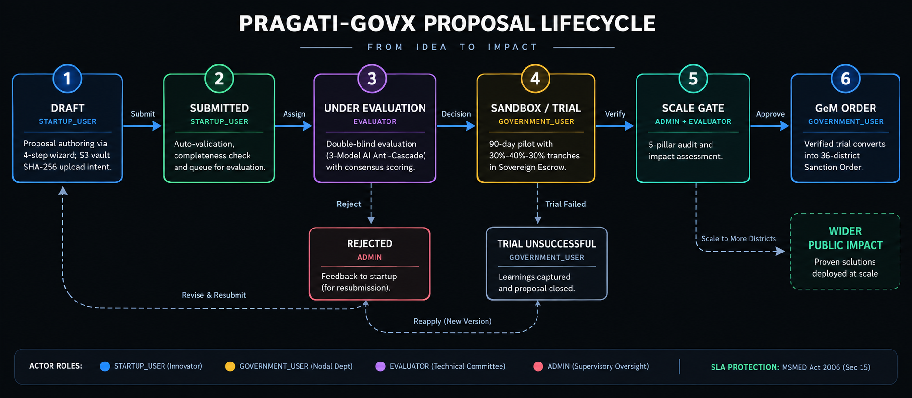

# Pragati-GovX: Comprehensive Technical Architecture & Engineering Specification

> **Platform Designation:** Sovereign Innovation Sandbox & Agile Public Procurement Gateway  
> **Target Jurisdiction:** Government of Maharashtra (MSInS / Dept. of Skills, Employment, Entrepreneurship & Innovation)  
> **Problem Statement ID:** SIH 2026 PS 26136 (PS:136)  
> **Statutory Foundations:** GFR 2017 Rule 173(i) • Maharashtra Startup Policy 2024 • MSMED Act 2006 Section 15 • GeM Procurement Gateway  

---

## Table of Contents
1. [System Overview & Architecture Philosophy](#1-system-overview--architecture-philosophy)
2. [Comprehensive Security Architecture](#2-comprehensive-security-architecture)
3. [Distributed Rate Limiting & DoS Defense](#3-distributed-rate-limiting--dos-defense)
4. [Finite State Machine (FSM) & Lifecycle Guards](#4-finite-state-machine-fsm--lifecycle-guards)
5. [Distributed Queues & Background Workers (BullMQ)](#5-distributed-queues--background-workers-bullmq)
6. [Multi-Model AI Anti-Cascade Consensus Engine](#6-multi-model-ai-anti-cascade-consensus-engine)
7. [Sovereign Treasury Escrow & Statutory Payment SLA Engine](#7-sovereign-treasury-escrow--statutory-payment-sla-engine)
8. [Cryptographic Cloud Evidence Vault (S3 Presigned Streaming)](#8-cryptographic-cloud-evidence-vault-s3-presigned-streaming)
9. [Forensic Audit Trail & Distributed Tracing](#9-forensic-audit-trail--distributed-tracing)
10. [External Government API Gateways & 36-District GIS](#10-external-government-api-gateways--36-district-gis)
11. [Frontend Architecture & State Management](#11-frontend-architecture--state-management)
12. [Automated Testing & Quality Assurance](#12-automated-testing--quality-assurance)

---

## 1. System Overview & Architecture Philosophy

Pragati-GovX is engineered as a zero-trust, outcome-driven civic procurement platform designed to dissolve the structural barriers that have historically disqualified innovative startups from government procurement.

### Core Architectural Tenets
* **Statutory Compliance as Code:** Legal mandates such as GFR Rule 173(i) exemptions, MSMED Act 2006 Section 15 payment SLAs, and double-blind procurement impartiality are embedded directly into database schemas, route guards, and state transition engines *(see the complete [Legal Terms & Statutory Framework Lexicon](README.md#️-legal-terms--statutory-framework-lexicon))*.
* **Separation of Concerns:** A clean decoupled architecture consisting of a client single-page application (`client/`), a Node.js Express RESTful backend (`server/`), a Redis-backed asynchronous job orchestrator, and an in-memory Vitest testing suite (`test/`).
* **Air-Gapped Confidentiality:** Proprietary startup intellectual property, source code, and commercial branding are strictly masked throughout the evaluation phase to eliminate vendor bias and protect commercial trade secrets.
* **Memory-Protected Presigned Streaming:** Large engineering dossiers and telemetry logs stream directly from the browser to encrypted cloud storage via presigned URLs, ensuring the Express backend runtime remains performant without memory exhaustion.

```
┌─────────────────────────────────────────────────────────────────────────────────────────────┐
│                                 SYSTEM TOPOLOGY OVERVIEW                                    │
├─────────────────────────────────────────────────────────────────────────────────────────────┤
│                                                                                             │
│  [ React + Vite ] ──(In-Memory JWT / HTTP-Only Cookie)──> [ Express.js Gateway ]     │
│             │                                                                │              │
│             │ (Direct S3 Presigned Streaming)                                │ (Queries)    │
│             ▼                                                                ▼              │
│  [ Supabase S3 Vault ] <─────────── SHA-256 Digest ─────────────── [ MongoDB Database ]     │
│                                                                              │              │
│                                                                              ▼              │
│  [ Multi-Model AI Chain ] <─────── Jobs & Cron Triggers ───────── [ Redis & BullMQ Queue ]   │
│  (Gemini + Groq + OpenRouter)                                                               │
└─────────────────────────────────────────────────────────────────────────────────────────────┘
```

---

## 2. Comprehensive Security Architecture

> **Dedicated Security Specification:** For an exhaustive cryptographic breakdown, session lifecycle state diagrams, direct-to-S3 streaming security, and the complete OWASP Top 10 mitigation matrix, see our dedicated **[Security Architecture & Cryptographic Flow Specification (Security.md)](Security.md)**.

Pragati-GovX enforces an enterprise-grade defense-in-depth security model across the entire application stack:

### 2.1 In-Memory Dual-Token Authentication Pattern (XSS & CSRF Defense)
To completely neutralize Cross-Site Scripting (XSS) token exfiltration and Cross-Site Request Forgery (CSRF):
1. **Short-Lived Access Token (15 Minutes):** Kept strictly in JavaScript memory closure via React `AuthContext`. It is **never written to `localStorage` or `sessionStorage`**, preventing malicious third-party scripts from stealing credentials.
2. **Long-Lived Refresh Token (7 Days):** Issued as a cryptographically signed cookie with the following security attributes:
   * `httpOnly: true` (Inaccessible to browser client scripts)
   * `secure: true` (Transmitted exclusively over HTTPS)
   * `sameSite: "Strict"` (Never forwarded with cross-origin requests, immunizing against CSRF)
   * `path: "/v1/auth/refresh-token"` (Restricted strictly to the refresh endpoint)
3. **Transparent Silent Token Rotation:** When the access token expires (HTTP 401), the Axios response interceptor intercepts the failure, invokes `GET /v1/auth/refresh-token`, updates the in-memory access token, and transparently replays queued user requests without session disruption.
4. **Stateful Session Invalidation:** Every issued refresh token is bound to a MongoDB `Session` document. Immediate revocation across all user devices occurs upon password changes or explicit logout.

### 2.2 HTTP Security Headers & Hardening (Helmet)
Configured via `helmet()` middleware in `server/app.js`:
* `Content-Security-Policy (CSP)`: Disallows arbitrary inline script evaluation.
* `X-Frame-Options: DENY`: Prevents UI clickjacking attacks.
* `X-Content-Type-Options: nosniff`: Mitigates MIME-type sniffing vulnerabilities.
* `Strict-Transport-Security (HSTS)`: Enforces HTTPS communication with preloading.
* `Referrer-Policy: strict-origin-when-cross-origin`: Restricts sensitive URI leakage.

### 2.3 Strict Origin Whitelisting (CORS)
CORS is dynamically governed via regex and explicit environment whitelists:
```javascript
const allowedOrigins = new Set([
  "http://localhost:3000",
  "http://localhost:5173",
  "http://localhost:3001",
  ...configuredOrigins,
]);

app.use(cors({
  origin: (origin, callback) => {
    if (!origin) return callback(null, true);
    const normalized = origin.replace(/\/$/, "");
    if (allowedOrigins.has(normalized) || /\.vercel\.app$/.test(normalized)) {
      return callback(null, true);
    }
    callback(new Error(`CORS policy: Origin ${origin} not allowed`));
  },
  credentials: true,
  methods: ["GET", "POST", "PUT", "DELETE", "PATCH", "OPTIONS"],
  allowedHeaders: ["Content-Type", "Authorization", "X-Request-ID"],
}));
```

### 2.4 Cryptographic Password Hashing
User passwords are encrypted using **Argon2** and **Bcrypt** with high cost factors (minimum 12 salt rounds), resistant against GPU-accelerated rainbow table attacks. Password schemas enforce strict complexity:
* Minimum 8 characters, maximum 128 characters
* At least one uppercase letter (`[A-Z]`)
* At least one lowercase letter (`[a-z]`)
* At least one numeric digit (`[0-9]`)
* At least one special symbol (`[@$!%*?&]`)

### 2.5 Role-Based Access Control (RBAC) Architecture
Every route is governed by a multi-tiered middleware gate in `server/middleware/auth.middleware.js`:
* **Level 1 (`requireAuth`)**: Verifies JWT cryptographic signature, expiry, and active DB session.
* **Level 2 (`requireRole(allowedRoles)`)**: Restricts access based on user role (`STARTUP_USER`, `GOVERNMENT_USER`, `EVALUATOR`, `ADMIN`).
* **Level 3 (`requirePermission(permission)`)**: Granular authorization for fine-grained operations (e.g. `problem:publish`, `evaluation:score`, `submission:review`).
* **Level 4 (`requireOrgAccess(roles)`)**: Enforces organization-level data boundaries.

---

## 3. Distributed Rate Limiting & DoS Defense

Rate limiting is orchestrated via `express-rate-limit` backed by a distributed Redis store (`rate-limit-redis`) in `server/middleware/ratelimit.middleware.js`.

### 3.1 Redis Distributed Store Architecture
```
[ Incoming Requests ] ──> [ Express Rate Limit Middleware ]
                                     │
                 ┌───────────────────┴───────────────────┐
                 ▼                                       ▼
        [ Redis Key-Value Store ]               [ In-Memory Store ]
        (Atomic Counter + TTL)                  (Fallback if Redis Offline)
```

Rate limiting keys use atomic Redis operations with time-to-live (TTL) expiry windows. If Redis becomes temporarily unreachable, the middleware sets `passOnStoreError: true`, gracefully falling back to local memory without dropping legitimate traffic.

### 3.2 Granular Endpoint Limiters

| Limiter Identifier | Target Endpoints | Window Duration | Max Requests | Response Code / Behavior |
|---|---|---|---|---|
| `loginLimiter` | `POST /v1/auth/login` | 15 Minutes | 5 attempts | `429 Too Many Requests` (Mitigates credential stuffing) |
| `registerLimiter` | `POST /v1/auth/register` | 60 Minutes | 5 accounts | `429` (Prevents bot-driven account flooding) |
| `otpLimiter` | `POST /v1/auth/verify-otp` | 10 Minutes | 3 attempts | `429` (Prevents brute-force 6-digit OTP guessing) |
| `passwordResetLimiter`| `POST /v1/auth/forgot-password`| 60 Minutes | 3 requests | `429` (Neutralizes email spam / enumeration) |
| `apiLimiter` | Global `/v1/*` | 15 Minutes | 300 requests | `429` (Protects server from API scraping / flood) |

### 3.3 RFC-Compliant Headers
All rate-limited endpoints emit standardized RFC headers:
* `RateLimit-Limit`: Maximum requests permitted within window.
* `RateLimit-Remaining`: Number of requests remaining.
* `RateLimit-Reset`: UNIX timestamp when quota resets.
* Legacy `X-RateLimit-*` headers are explicitly disabled to conform to modern IETF HTTP standards.

---

## 4. Finite State Machine (FSM) & Lifecycle Guards

Startup proposals proceed through a strictly governed 7-stage Finite State Machine defined in `server/services/submission/transitionGuard.js`.

### 4.1 State Machine Transition Graph

<p align="center">
  
</p>


### 4.2 Legal Transition Rules & Actor Authorization
The transition matrix explicitly prohibits illegal state jumps and enforces strict role permissions:
* **No Premature Activation**: Direct jump from `DRAFT` to `PILOT_ACTIVE` throws `400 INVALID_TRANSITION`.
* **Role Invariants**: Only `STARTUP_USER` can transition `DRAFT` to `SUBMITTED`. Only `GOVERNMENT_USER` or `ADMIN` can mark a submission `ACCEPTED`, `REJECTED`, or `SCALED`.
* **State Immutability**: Closed or withdrawn submissions are terminal states; no further transitions are permitted.

---

## 5. Distributed Queues & Background Workers (BullMQ)

Asynchronous workflows, external model inference, and statutory SLA countdowns are orchestrated using **BullMQ** on top of **Redis** (`server/queues/` and `server/workers/`).

```
┌─────────────────────────────────────────────────────────────────────────────────────────────┐
│                                   BULLMQ QUEUE ORCHESTRATION                                │
├─────────────────────┬──────────────────────┬──────────────────────┬─────────────────────────┤
│  ai.queue           │  cron.queue          │  email.queue         │  notification.queue     │
│  • Multi-Model Chain│  • Statutory 30-Day  │  • Transactional     │  • Real-Time Alert      │
│  • Concurrency: 3   │    Payment SLA Mon.  │    HTML Notices      │    Dispatch             │
│  • Exponential Retry│  • Midnight Cron     │  • Exponential Retry │  • Priority Broadcast   │
└─────────────────────┴──────────────────────┴──────────────────────┴─────────────────────────┘
```

### 5.1 Asynchronous Workers

1. **`ai.worker.js` (AI Verification Worker)**:
   * Consumes jobs from `ai-verification-queue`.
   * Executes multi-model anti-cascade verification across Gemini 3.6 Flash and Groq LLaMA-3.3.
   * Persists verification results, confidence scores, and discrepancies directly into the `AIRun` schema and marks status `COMPLETED`.
   * Employs exponential backoff (initial delay 5000ms, max 3 retries).

2. **`cron.worker.js` (Statutory SLA Monitor Worker)**:
   * Scheduled job running at regular intervals to monitor active sandbox pilots.
   * Calculates elapsed calendar days since milestone deliverable approval under Section 15 of the MSMED Act 2006.
   * Dispatches warning alerts at Day 15, Day 25, and Day 30. If the 30-day statutory payment SLA lapses, it logs statutory interest liabilities into the immutable audit trail.

3. **`email.worker.js` & `notification.worker.js`**:
   * Asynchronously dispatches transactional HTML notifications (pilot sanction offers, evaluator assignments, clarification requests, escrow releases) without blocking API response cycles.

---

## 6. Multi-Model AI Anti-Cascade Consensus Engine

To eliminate human evaluator bias while preventing single-model AI hallucinations, Pragati-GovX deploys a sequential multi-model consensus verification chain (`server/services/ai/verification.service.js`).

```
┌─────────────────────────────────────────────────────────────────────────────────────────────┐
│                              MULTI-MODEL AI CONSENSUS CHAIN                                 │
├───────────────────────────────┬───────────────────────────────┬─────────────────────────────┤
│  LAYER 1: GENERATOR           │  LAYER 2: INDEPENDENT AUDITOR │  LAYER 3: CONSENSUS ARBITER │
│  Google Gemini 3.6 Flash      │  Groq LLaMA-3.3 70B           │  OpenRouter / Fallback      │
│  • Synthesizes dossier        │  • Cross-audits claims        │  • Resolves discrepancy     │
│  • Extracts technical claims  │  • Verifies schematics & logs │  • Final consensus score    │
└───────────────────────────────┴───────────────────────────────┴─────────────────────────────┘
```

### 6.1 Strict AI Governance Policy (`ai.policy.js`)
* **Zero-Price Allowlist**: Strictly permits zero-cost/freemium model identifiers (`gemini-3.6-flash`, `llama-3.3-70b-versatile`). Requests attempting to invoke unauthorized paid models are rejected with HTTP 403 Forbidden.
* **Credential Redaction**: Prompts are automatically scrubbed of API keys, Bearer tokens, passwords, and PII before transmission to LLM inference endpoints.
* **Payload Truncation Protection**: Strict prompt length cap of 30,000 characters prevents denial-of-wallet and context-overflow attacks.

---

## 7. Sovereign Treasury Escrow & Statutory Payment SLA Engine

To resolve the lethal 6-to-18-month payment delays that bankrupt early-stage startups, Pragati-GovX operationalizes a **Sovereign Treasury Escrow Engine** (`server/services/payment.service.js` and `server/models/escrow.model.js`).

### 7.1 Milestone Tranche Schedule
Upon sanction of a 90-day sandbox pilot, the full grant corpus (e.g. ₹25,00,000) is pre-committed to escrow and disbursed across three verifiable phases:
* **Phase 1: Inception & Hardware Deployment (30%)** — Released upon sandbox boundary setup and baseline sensor calibration.
* **Phase 2: Operational Telemetry & Mid-Term Review (40%)** — Released upon live data ingestion and mid-term milestone validation.
* **Phase 3: Final KPI Audit & Signoff (30%)** — Released upon successful completion of the 5-pillar Scale Gate audit.

### 7.2 Statutory 30-Day SLA & Interest Engine
* **Statutory Foundation:** Section 15 of the Micro, Small and Medium Enterprises Development (MSMED) Act 2006 and Maharashtra Government Resolution No. MAT-2024/CR-88/Ind-7.
* **Automated Countdown:** Upon startup deliverable submission, an automated 30-day statutory countdown timer activates.
* **Compound Interest Penalty:** If the department fails to process or dispute the milestone within 30 days, the engine automatically calculates penal interest at three times the Reserve Bank of India (RBI) bank rate, logged into the department's vigilance audit record.

---

## 8. Cryptographic Cloud Evidence Vault (S3 Presigned Streaming)

Technical proposals require multi-megabyte schematics, sensor telemetry datasets, and architecture whitepapers. Pragati-GovX implements a direct-to-cloud presigned streaming pipeline (`server/services/storage.service.js`).

```
[ Browser Client ] ── 1. Calculate SHA-256 in memory ──> [ Local Digest ]
        │
        ├── 2. Request Presigned PUT URL ──────────────> [ Express API ]
        │                                                     │
        │ <── 3. Returns S3 Presigned URL + Record ID ────────┤
        │
        └── 4. Streams Binary Direct to Bucket ─────────> [ Supabase S3 Vault ]
```

### 8.1 Zero-Memory Streaming Pipeline
1. **Client-Side Cryptographic Hashing:** The browser calculates the SHA-256 checksum in memory using the native Web Cryptography API (`crypto.subtle.digest("SHA-256", fileBuffer)`) before initiating upload.
2. **Presigned Intent Request:** The client sends file metadata and the SHA-256 hash to `POST /v1/evidence/upload-intent`.
3. **Presigned URL Generation:** The server verifies authorization, creates a pending `Evidence` record, and generates an AWS S3 presigned PUT URL valid for 15 minutes.
4. **Direct Cloud Ingestion:** The browser streams the binary file directly to Supabase S3 storage (`@aws-sdk/client-s3`), entirely bypassing Express server memory.
5. **MIME & Size Enforcement:** Strict allowlist (`application/pdf`, `application/json`, `text/csv`, `image/png`, `image/jpeg`, `application/zip`) with a hard 25 MB file limit. Executable binaries (`.exe`, `.sh`, `.bat`) are blocked at both client and server boundaries.

---

## 9. Forensic Audit Trail & Distributed Tracing

Every critical mutation across the platform is immutably logged in `AuditEvent` documents (`server/services/audit.service.js`).

### 9.1 Distributed Trace Correlation (`x-trace-id`)
* Every incoming HTTP request is intercepted by `requestId.middleware.js`, assigning a unique UUID v4 identifier (`req.id = uuidv4()`).
* The trace ID is injected into the response header (`X-Request-ID`), attached to Morgan logs, and recorded in every database audit event.
* Enables end-to-end forensic reconstruction of multi-step procurement events for state vigilance commissions and the Comptroller and Auditor General (CAG).

### 9.2 Automated Sensitive Data Redaction
The audit service recursively scrubs sensitive data keys prior to database persistence:
```javascript
const sensitiveKeys = ["password", "token", "jwt", "authorization", "secret", "apiKey", "refreshToken"];
```

---

## 10. External Government API Gateways & 36-District GIS

Pragati-GovX interfaces with state and national public digital infrastructure:

* **DigiLocker Gateway (`digilocker.service.js`)**: Verifies founder identity documents and DPIIT startup incorporation certificates.
* **API Setu Gateway (`apiSetu.service.js`)**: Facilitates inter-departmental data exchange across Maharashtra state databases.
* **Open Government Data (OGD) Gateway (`ogd.service.js`)**: Ingests public datasets for municipal baseline KPI formulation.
* **Nominatim Geocoding & Leaflet GIS**: Geocodes departmental problem statements across all 36 Maharashtra administrative districts (Konkan, Pune, Nashik, Marathwada, Vidarbha divisions), enabling spatial clustering and geographic challenge discovery.

---

## 11. Frontend Architecture & State Management

The frontend client (`client/`) is built as a high-performance Single Page Application (SPA) using **React 18** and **Vite**:

* **Declarative Server State:** Managed via **TanStack React Query v5**, featuring automatic background refetching, query key-based cache invalidation, and optimistic UI mutations.
* **Accessible Headless UI:** Constructed using **Radix UI primitives** styled with **Tailwind CSS** (zero-runtime overhead, customized civic-tech design system).
* **Double-Blind UI Insulation:** Evaluator views strictly exclude vendor identifiers, rendering synthetic sovereign badges (`ANON-VENTURE-XXXX`).
* **Visual Data Analytics:** Interactive SVG-based radar charts for 4-pillar evaluation rubrics, pipeline stage donuts, and milestone progress bars powered by **Recharts**.
* **Toast Notification Pipeline:** Real-time user alerts managed via **Sonner** with stacked, non-blocking toast notifications.

---

## 12. Automated Testing & Quality Assurance

The codebase incorporates a comprehensive automated test suite built on **Vitest** (`test/`):

```
✓ test/aiPolicy.test.js           # AI model allowlist & token sanitization (6 tests)
✓ test/authValidator.test.js      # Password complexity & OTP verification (12 tests)
✓ test/redisQueue.test.js         # BullMQ queue priority & retry resilience (11 tests)
✓ test/transitionGuard.test.js    # 7-stage FSM state machine transitions (8 tests)
✓ test/eligibilityRules.test.js   # GFR 173(i) DPIIT turnover/experience waivers (12 tests)
✓ test/evidenceValidator.test.js  # S3 MIME & 25MB file boundary tests (5 tests)
✓ test/Pipeline.test.js           # End-to-end challenge-to-submission lifecycle (9 tests)
✓ test/SandboxEscrow.test.js      # Escrow funding, milestone math & tranche release (14 tests)
✓ test/Decision.test.js           # Sanction order, milestone tranches & compact acceptance (12 tests)
✓ test/Clarification.test.js      # Department-to-startup clarification cycles (10 tests)

Test Files:  10 passed (10)
Tests:       99 passed (99)
Duration:    1.86s
```

* **Zero External DB Dependency:** Tests run in-memory using mocked storage and atomic isolated fixtures, enabling sub-2-second execution.
* **Continuous Integration:** Automated GitHub Actions pipeline (`.github/workflows/ci.yml`) runs test suites and production build validation on every commit.

---

*Authoritative documentation maintained for Smart India Hackathon 2026 (PS 26136) • Pragati-GovX Architecture Council*
